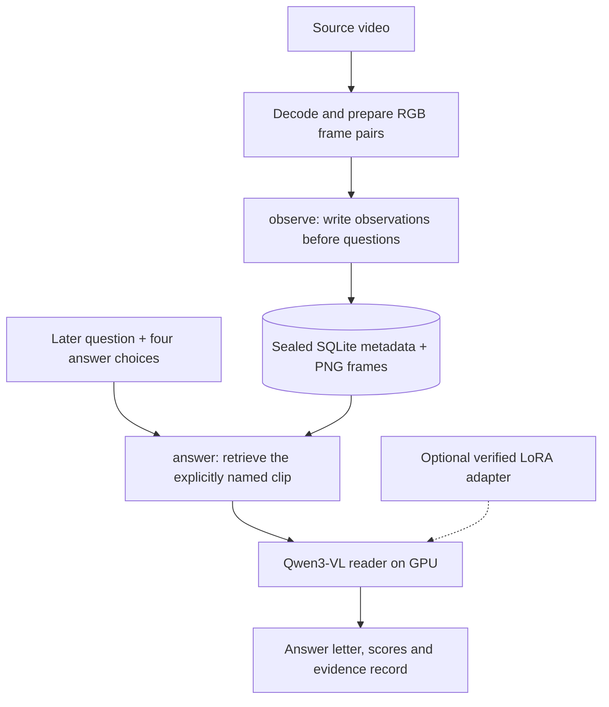
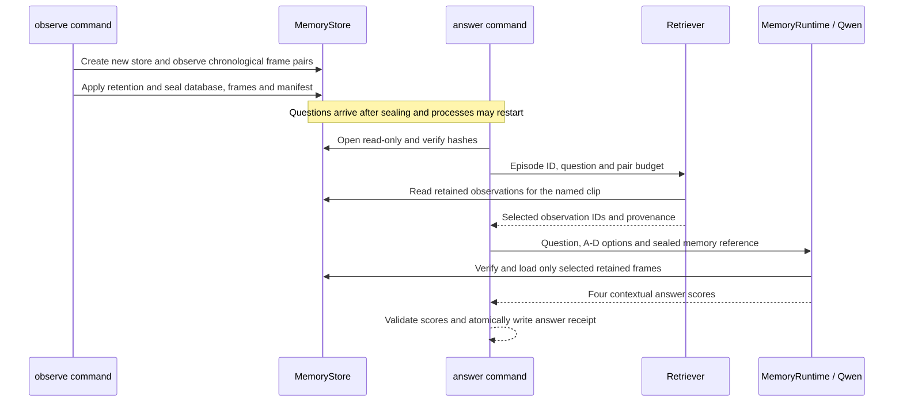

# Architecture and system design

This project asks whether a video-language model can answer questions about an earlier spatial observation after later footage appears. It implements two workflows: **offline fine-tuning/evaluation** and **answering from persistent frame memory**.

The selected reader is the **base Qwen3-VL-4B model with memory retrieval**. The separately trained memory reader did not improve validation accuracy. [Measured results](REPORT.md).

[High-level design](#high-level-design) · [Technology stack](#technology-stack) · [Low-level design](#low-level-design) · [Training and evaluation](#training-and-evaluation) · [File structure](#file-structure) · [Testing and operations](#testing-and-operations)

## High-level design



These are Python CLI stages connected by local files. Preparation, memory writing and result inspection run on CPU. The demonstrated model inference and training use one A100 80 GB. There is no deployed inference API or database server. The README video and local results explorer replay saved evidence.

**Preparation and observation are separate:** `ecqa memory observe` takes prepared image paths in JSONL, not a raw video. After the writer seals a store, a later process can reopen it and answer several questions. A sealed store is immutable; new observations require a new store.

## Technology stack

| Layer | Implementation | Purpose |
|---|---|---|
| Language and CLI | Python ≥3.10; recorded GPU run: 3.10 | `argparse` commands, batch stages |
| Vision-language model | Qwen3-VL-4B-Instruct | Score the four supplied answers from visual evidence |
| GPU framework | PyTorch 2.6.0, torchvision 0.21.0, CUDA 12.4 build | BF16 inference, gradients and optimization |
| Model and adapters | Transformers 4.57.1, PEFT 0.18.1, Accelerate 1.12.0 | Pinned processor/model and language-only LoRA |
| Media and arrays | PyAV 13.1.0, Pillow 12.0.0, NumPy 2.2.6 in the recorded run | Decode video and prepare RGB frames |
| Memory | Python SQLite + lossless PNG files | Store observations and reopen verified evidence |
| Configuration and records | YAML, JSON/JSONL, SHA-256 | Settings, predictions and artifact identities |
| Presentation | Optional Matplotlib 3.10.7; PyAV/FFmpeg video tools | Charts and edited result videos |
| Development | pytest 8.4.2, Ruff 0.13.0, setuptools, GitHub Actions | CPU checks, packaging and CI |

Install requirements are defined in [pyproject.toml](pyproject.toml). Exact recorded GPU dependencies are in [gpu-lock.txt](results/fullstudy/gpu-lock.txt); plotting dependencies are in [requirements-figures.txt](requirements-figures.txt). The model and processor share immutable revision `ebb281ec70b05090aa6165b016eac8ec08e71b17`.

## Low-level design

### Write, seal, retrieve, score



The prompt contains the question, choices and a map of selected evidence. Gold answers and audit labels are excluded. The processor preserves prepared frame geometry; overlong inputs are rejected instead of truncated. The highest contextual answer-token score selects A, B, C or D. Scores and the top-two margin are **not calibrated confidence probabilities**.

### Interfaces and data contracts

| Interface | Required input | Output |
|---|---|---|
| `ecqa memory observe` | JSONL: `episode_id`, `scene_id`, `clip_index`, `pair_index`, `timestamp`, two `frames`, `source_id`; optional `spatial` | New sealed store and store statistics |
| `ecqa memory answer` | JSONL with exactly `episode_id`, `question`, `options` containing A–D; store, configuration and optional adapter paths | JSON receipt with model/code/question identities and an `answers` list |
| Each answer | One valid question referencing a retained clip | `prediction`, four `scores`, `margin`, scoring `seconds`, and `evidence` provenance |

Observation image paths resolve relative to their JSONL file. Pair indices, clip indices and timestamps must remain chronological within each episode. Images must satisfy the reader's RGB, shape and pixel-budget requirements. Public timestamps are caller supplied; the benchmark projection uses a synthetic prepared timeline, not measured flight time.

Run from the repository after preparing valid input files and installing the [GPU environment](PLAN.md#gpu-setup):

```bash
ecqa memory observe --observations observations.jsonl --output memory-store
ecqa memory answer --config configs/memory.yaml --store memory-store \
  --questions questions.jsonl --output answers.json --max-pairs 1
```

The question file supplies the four candidate answers; this is not a free-form chatbot. [Complete input examples and workflow](PLAN.md#reproduce-or-use-the-memory-workflow).

### Storage and memory policy

```text
memory-store/
├── memory.sqlite       # retained observations and writer metadata
├── manifest.json       # database/frame inventory and integrity hashes
└── frames/
    ├── 00000001_0.png   # first image of one observation
    └── 00000001_1.png   # second image of that observation
```

| SQLite table | Columns and contents |
|---|---|
| `metadata` | `value`: JSON containing schema, retention policy, seed, capacity and sealed status |
| `progress` | `episode_id` primary key, `value`: latest observed position and source identity |
| `observations` | `observation_id` primary key, `episode_id`, `value`: clip/pair/time, source and scene IDs, frame paths, dimensions, hashes, sizes and optional spatial annotations |

**Retention decides what survives writing.** `episode` balances retained episode/clip groups, `recent` keeps the newest pairs, and `reservoir` uses seeded hash selection. Evicted images are removed. Capacity is a global pair count per store, not a byte limit; one store per episode is the simplest usage.

**Retrieval decides what the reader sees.** Normal retrieval resolves an explicit clip reference from the question and selects retained pairs from that clip. It does not use the answer choices or gold label to choose evidence. The measured configuration retains four pairs/eight frames and retrieves one pair/two frames. The public `answer` command defaults to a maximum of four pairs; `--max-pairs 1` explicitly applies the measured reader budget.

`uniform`, `recent`, wrong-clip and empty inputs are diagnostic comparisons. Annotation-assisted `oracle` retrieval is a separate diagnostic, not the normal answer path. Missing or ambiguous clip references and missing retained evidence cause the public answer command to refuse the request.

### What “spatial memory” currently means

Memory stores earlier **visual evidence on disk**, rather than learning an episode inside the model's weights. The optional `--use-spatial` path accepts caller-supplied 2D boxes and derives relations within the same frame; overlapping or insufficiently separated boxes produce `unknown`. It does not detect objects or verify those annotations.

Semantic/vector retrieval, automatic tracking, cross-frame object identity, 3D maps, SLAM and persistent model KV memory are not implemented. The reported retrieval gains do not validate the optional box-annotation layer or generalization to unseen videos.

## Training and evaluation

| Stage | Implementation and artifact |
|---|---|
| Acquire and review | Pinned SIS-Motion-54K/SIS-Bench data → reviewed frames, answers, boundaries and source/donor records |
| Prepare and freeze | Validate splits and controlled conditions; hash configuration, code, records and media into `protocol.json` |
| Train original adapter | Original training records → LoRA checkpoints; base and vision weights remain frozen |
| Evaluate original study | Base and selected adapter; original, neutral, competing and text-only test conditions → identity-bound prediction rows |
| Diagnose memory | Seal question-free stores; compare retrieval policies, frame budgets, prompts and adapters → paired metrics |
| Train memory reader | Fresh base + retrieved training evidence → separate adapter; compare on validation only |
| Report and present | Complete verified predictions → metrics, report, charts and saved video replay |

The completed cohort contains 108 training, 50 validation and 27 test questions. Labels were AI-reviewed. Preparation does not automatically approve data: review records and known source/donor separation must pass before freezing. Exact reproduction requires the original prepared inputs and review ledgers. [Dataset setup](PLAN.md#dataset-setup).

LoRA targets language self-attention `q_proj`, `k_proj`, `v_proj`, `o_proj`: rank 32, alpha 64, dropout 0.05. The run uses one epoch, batch size one, accumulation four, learning rate `1e-5`, AdamW, cosine decay and seed 42. Only answer continuation tokens contribute to loss. [Configuration](configs/fullstudy.yaml) and [run commands](PLAN.md#train-evaluate-and-report).

Selection rules differ deliberately: the original study fixes its **end-of-run** adapter before either test model is scored. The separate memory-reader experiment selects tuning only for a **strict validation accuracy improvement**; ties retain base. The original distraction score stayed 18/27; the memory-reader validation comparison stayed 46/50. Reused-test memory diagnostics are regression evidence, not a fresh holdout. [Results and limitations](REPORT.md).

Checkpoints preserve adapters, processor, optimizer/scheduler, RNG, data order and identity metadata. Resume requires a complete matching checkpoint. Prediction rows resume only under matching input/model/protocol identities; reports reject incomplete or inconsistent comparisons. Frozen historical runs need their matching frozen source. [Recovery](PLAN.md#recovery-and-verification).

## File structure

| Location | Responsibility |
|---|---|
| [ecqa/cli.py](ecqa/cli.py) | Entry point; original freeze/train/evaluate/report stages |
| [ecqa/data.py](ecqa/data.py), [scripts/](scripts/) | Media preparation, review workflow and experiment runners |
| [ecqa/model.py](ecqa/model.py), [ecqa/train.py](ecqa/train.py) | Qwen processor/scorer, LoRA and checkpointed training |
| [ecqa/memory_study.py](ecqa/memory_study.py) | Public observe/answer commands and memory experiments |
| [ecqa/memory.py](ecqa/memory.py), [ecqa/retrieval.py](ecqa/retrieval.py) | Store lifecycle, retention and evidence selection |
| [ecqa/memory_model.py](ecqa/memory_model.py), [ecqa/spatial.py](ecqa/spatial.py) | Memory-backed reader and optional supplied 2D annotations |
| [ecqa/memory_train.py](ecqa/memory_train.py) | Separate memory-reader training and validation selection |
| [ecqa/evaluate.py](ecqa/evaluate.py), [ecqa/memory_eval.py](ecqa/memory_eval.py), [ecqa/analysis.py](ecqa/analysis.py) | Prediction records, paired metrics and reports |
| [ecqa/artifacts.py](ecqa/artifacts.py) | Hashes, protocol identity, validation and atomic writes |
| [configs/](configs/), [tests/](tests/), [results/](results/) | Experiment settings, CPU tests and preserved numerical evidence |
| `data/`, `artifacts/`, `backups/`, `.model-cache/` | Ignored local datasets, runtime files, handoff and model cache |

## Testing and operations

CPU CI runs Ruff, dependency/CLI checks, **251 synthetic tests**, result inspectors, media-exclusion checks and tests from the built source distribution. It does not train Qwen or prove GPU accuracy. Separate recorded GPU checks cover loss/scorer agreement, frozen weights, adapter updates, save/reload and training resume. [Development commands](CONTRIBUTING.md) · [Recorded checks](PROGRESS.md) · [CI](.github/workflows/tests.yml).

Store corruption, changed frame geometry, path escapes, incompatible adapters, invalid scores and changed run identities fail explicitly. Answer outputs must be new files outside the sealed store. Full file hashing favors reproducibility for these small experiments; production concurrency and latency guarantees have not been established.

Keep unique datasets, review ledgers, adapters, optimizer state, stores and receipts before removing temporary compute. Base weights and runtime dependencies require downloading again; GPU shutdown/deletion is not part of the scripts. The verified handoff and restore process are in [PLAN.md](PLAN.md#restore-after-gpu-removal). Original code is MIT; datasets, model and demo footage retain the scopes in [NOTICE.md](NOTICE.md).
