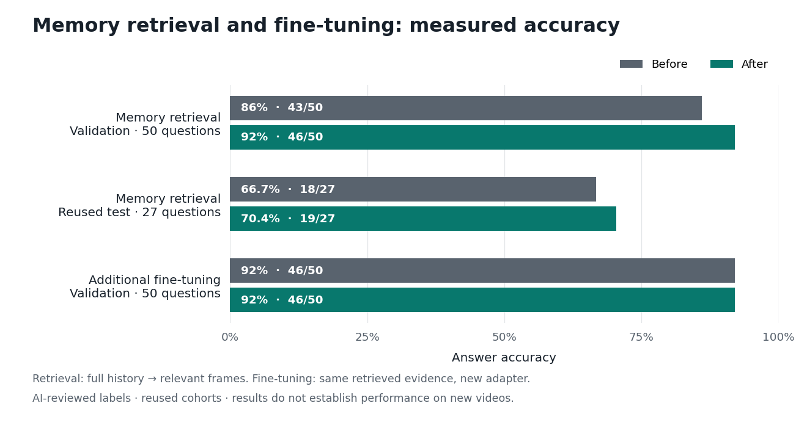
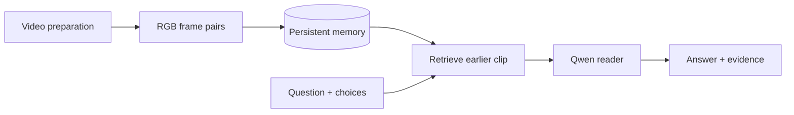

# Spatial recall from video

Can a video-language model answer questions about an earlier spatial observation after distracting footage appears?

This project tests **LoRA fine-tuning of Qwen3-VL-4B** on UAV video questions, then evaluates it with competing later footage. A second experiment adds **persistent frame memory** to retrieve the relevant earlier scene before answering.

For example: *“In the second clip, what was to the right of the truck?”* The system must use the referenced scene even after other scenes have appeared. It selects one of four supplied answers.

[Architecture and system design](ARCHITECTURE.md) · [Results report](REPORT.md) · [Video test](#actual-video-test) · [Setup and reproduction](PLAN.md) · [Progress](PROGRESS.md)

## Results

**Original goal:** fine-tuning completed, but accuracy on the 27-question distraction test stayed **18/27 → 18/27**.

**Memory follow-up:** retrieval improved validation **43/50 → 46/50** and reused-test accuracy **18/27 → 19/27**. Training a new reader on retrieved evidence added no validation gain: **46/50 → 46/50**. The selected system is **the base model with memory retrieval**.



The Matplotlib chart uses [saved metrics](results/overview/provenance.json). Retrieval changes both images and prompt; the reader-training comparison changes only the adapter. These small, reused cohorts have AI-reviewed labels, so the gains do not establish performance on new videos. [Full comparisons and limitations](REPORT.md).

## Actual video test

**16 seconds, one question, before and after memory retrieval.**

https://github.com/user-attachments/assets/6da7cba0-7908-42fe-9e95-0c5641ef29c5

**Before:** white car — incorrect. **After memory:** spherical lights — correct.

An edited replay of recorded answers on one reused validation video. The zoom and labels are for display only. [All six original predictions](results/video-demo/data.json) · [Edit provenance](results/video-demo/simple-provenance.json) · [Reproduce locally](PLAN.md#reproduce-the-actual-video-test).

## Architecture



[High-level design](ARCHITECTURE.md#high-level-design) · [Low-level design and storage](ARCHITECTURE.md#low-level-design) · [Technology stack](ARCHITECTURE.md#technology-stack) · [Training and evaluation](ARCHITECTURE.md#training-and-evaluation)


The memory survives process restarts. Retrieval currently uses clip numbers. Semantic search, automatic object tracking and 3D mapping are not implemented. [Memory workflow](PLAN.md#reproduce-or-use-the-memory-workflow).

## Quickstart: no GPU

Verify the included results with Python 3, without downloading a model:

```bash
python3 scripts/inspect_results.py
python3 scripts/inspect_memory_results.py
python3 scripts/inspect_memory_results.py --root results/memory-reader
```

These commands verify hashes and recompute accuracy counts. **251 CPU tests passed** in the recorded release; training and GPU checks are documented in [PROGRESS.md](PROGRESS.md).

For installation and tests, see [CONTRIBUTING.md](CONTRIBUTING.md). For inference, training and evaluation, follow [GPU setup](PLAN.md#gpu-setup) and the [reproduction plan](PLAN.md). Exact reproduction requires the saved inputs and checkpoints, which are not included in a Git clone.

## Repository and stack

```text
ecqa/       # data preparation, model, training, evaluation and memory
configs/    # experiment settings
scripts/    # runs, verification and Matplotlib figures
tests/      # CPU tests with synthetic fixtures
results/    # measured results, figures and recorded video test
```

Python 3.10, PyTorch 2.6.0, Transformers 4.57.1, PEFT 0.18.1, PyAV, Pillow, SQLite and Matplotlib. GPU experiments used one NVIDIA A100 80 GB. [Component responsibilities](ARCHITECTURE.md#file-structure).

## Sources and license

Model: [Qwen3-VL-4B](https://huggingface.co/Qwen/Qwen3-VL-4B-Instruct). Research and data: [Self-in-Space](https://github.com/IntelliSensing/Self-in-Space), [SIS-Motion-54K](https://huggingface.co/datasets/choucsan/SIS-Motion-54K), [SIS-Bench](https://huggingface.co/datasets/choucsan/SIS-Bench) and [AirScape](https://huggingface.co/datasets/EmbodiedCity/AirScape-Dataset).

Original project code is licensed under **[MIT](LICENSE)**. Dataset-derived text, demo footage and external dependencies retain their own terms; see [NOTICE.md](NOTICE.md). Model weights and raw footage are not included in Git. [Release preparation](CONTRIBUTING.md#prepare-a-push).

Maintainers: keep the ignored data, artifacts and backups when removing the temporary GPU. [Verified handoff and restore instructions](PLAN.md#restore-after-gpu-removal).

## Documentation

| Read | Find |
|---|---|
| [Architecture](ARCHITECTURE.md) | High-level and low-level design, stack, interfaces and storage |
| [Plan](PLAN.md) | Dataset setup, GPU setup, run commands and restoration |
| [Report](REPORT.md) | Measured results and limitations |
| [Progress](PROGRESS.md) | Completed work and recorded checks |
| [Contributing](CONTRIBUTING.md) | Development setup, tests and release workflow |
| [License notice](NOTICE.md) | Original code and third-party terms |
